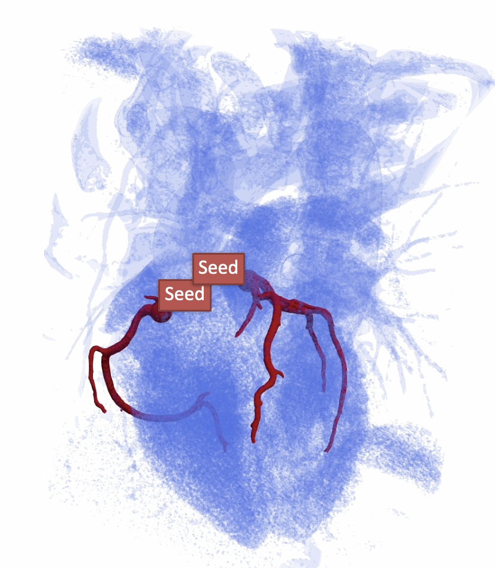
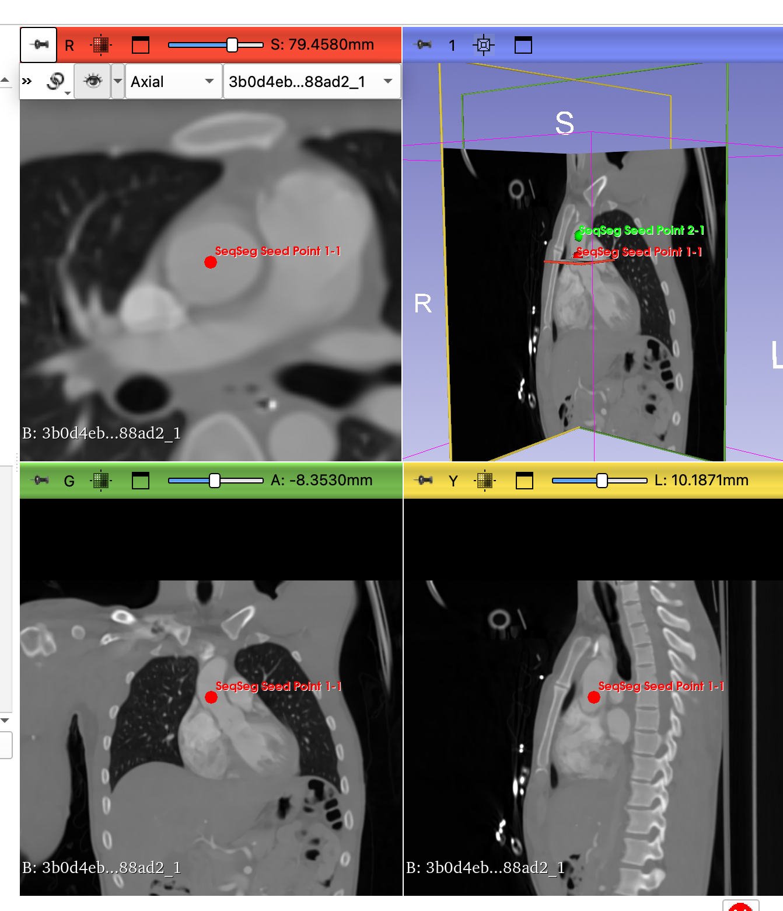
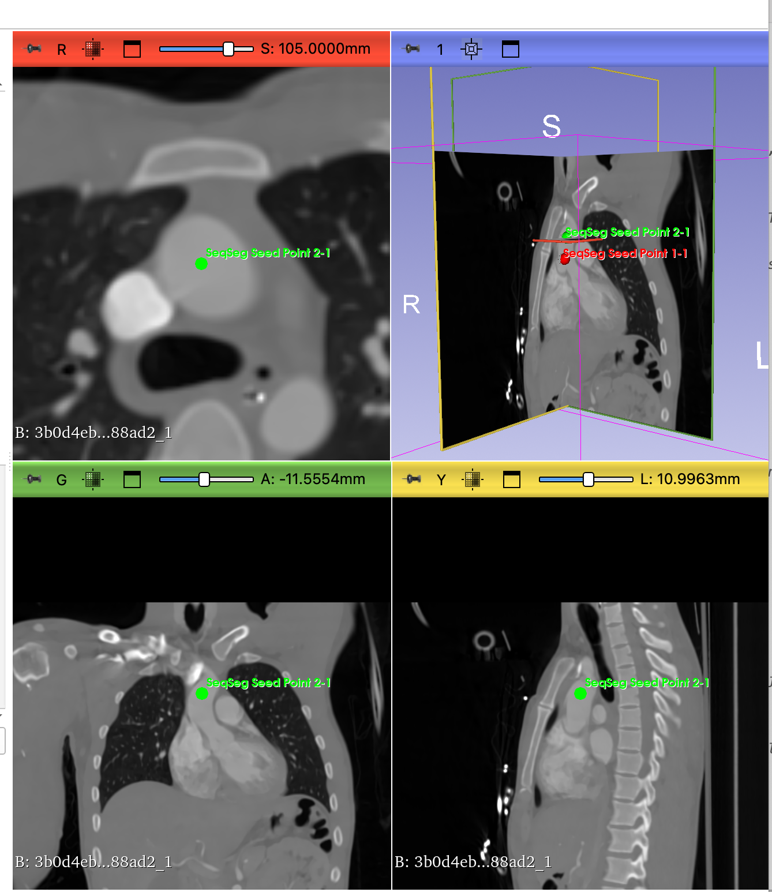
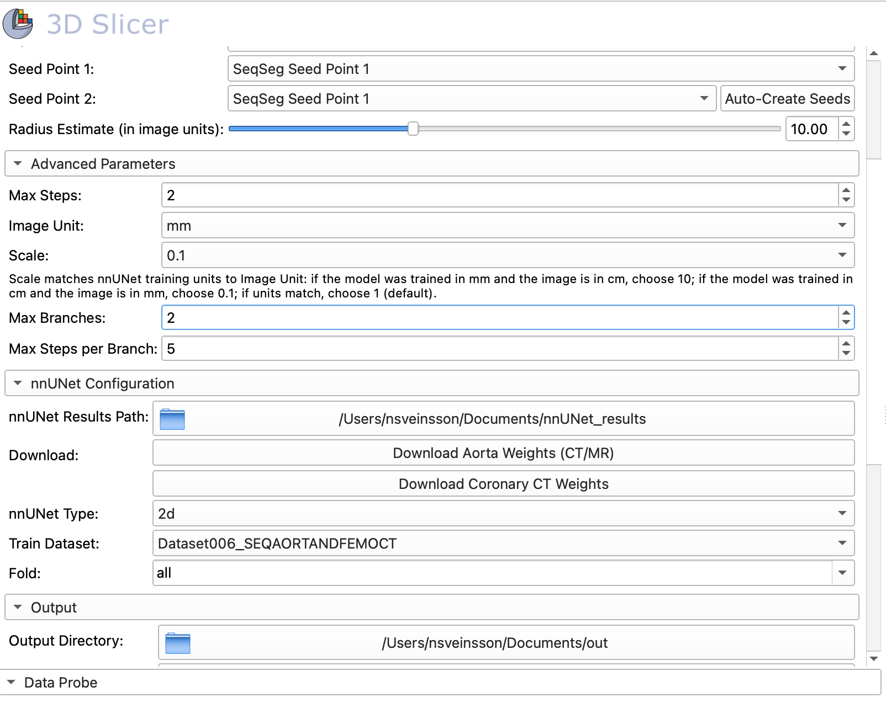

<p align="center">
  
</p>

# SeqSeg Vessel Segmentation (SeqSegVesselSegmentation)



**SeqSeg Vessel Segmentation** is the public name of this [3D Slicer](https://www.slicer.org/) extension (CMake / Extension Manager project: **SeqSegVesselSegmentation**). It is aimed at clinicians and researchers who want to segment tubular structures (for example coronary or other vessels) from CT or MR without drawing full contours. You place two seed points and a radius hint; the module runs the [SeqSeg](https://github.com/numisveinsson/SeqSeg) Python workflow with nnUNet models and loads the result back into Slicer. **Pretrained model weights are not something you train yourself:** in the module’s **nnUNet Configuration** section you fetch them with **built-in download buttons** (Slicer may ask for a save folder once); no command-line nnUNet setup is required for typical use.

## Modules

- **SeqSeg Vessel Segmentation** (internal module id: `seqseg`) — Scripted module in the Segmentation category: selects a volume, two fiducial markups, optional **one-click** nnUNet weight downloads and paths, runs the SeqSeg CLI, then loads segmentation (.mha) and optional surface (.vtp) outputs.

## Publication

If you use the SeqSeg method, Python package, or this extension in research, please cite:

Sveinsson Cepero, N., Shadden, S.C. SeqSeg: Learning Local Segments for Automatic Vascular Model Construction. *Ann Biomed Eng* **53**, 158–179 (2025). [https://doi.org/10.1007/s10439-024-03611-z](https://doi.org/10.1007/s10439-024-03611-z)

**Known patents:** None known to the extension authors; if that changes, update this section and the extension description in `CMakeLists.txt`.

## Prerequisites

**Neural network weights (the pretrained files the model runs with):** use the **Download Aorta Weights (CT/MR)** and **Download Coronary CT Weights** **buttons** inside the module’s nnUNet section. You choose a parent folder when asked; the extension downloads from Zenodo, unpacks, and can set **nnUNet Results Path** automatically. You do **not** need to train networks or copy files by hand unless you use your own custom-trained models.

The SeqSeg Python package is automatically installed when you first use this extension. However, you can also install it manually if preferred:

```bash
pip install seqseg
```

Or use the provided setup script:

```bash
python setup_dependencies.py
```

## Tutorial sample data

You can practice the workflow on **CTA-cardio**, a cardiac CT angiography–style volume from the [Slicer testing data](https://github.com/Slicer/SlicerTestingData) collection:

- **File**: `CTA-cardio.nrrd`
- **SHA256**: `3b0d4eb1a7d8ebb0c5a89cc0504640f76a030b4e869e33ff34c564c3d3b88ad2`
- **Download**: [https://github.com/Slicer/SlicerTestingData/releases/download/SHA256/3b0d4eb1a7d8ebb0c5a89cc0504640f76a030b4e869e33ff34c564c3d3b88ad2](https://github.com/Slicer/SlicerTestingData/releases/download/SHA256/3b0d4eb1a7d8ebb0c5a89cc0504640f76a030b4e869e33ff34c564c3d3b88ad2)

Browsers often save that URL as a file named only with the SHA256 hash and **no extension**. Before loading in Slicer, **rename the file** on disk to end with **`.nrrd`** (for example `CTA-cardio.nrrd`) so Slicer recognizes it as NRRD.

In 3D Slicer, use **File → Add Data**, paste the download URL, or choose the renamed file; confirm the checksum if prompted.

**For this tutorial**, use the **CT aorta** pipeline: in **nnUNet Configuration**, click the **Download Aorta Weights (CT/MR)** button; after the download finishes, **nnUNet Results Path** is usually filled in for you (otherwise pick the folder that contains `nnUNet_results`). When the module asks, choose **CT** so **Train Dataset** is set to `Dataset006_SEQAORTANDFEMOCT` (you can also pick that value directly from the **Train Dataset** dropdown). Do not use the separate coronary CTA button for this walkthrough (see Usage below).

### Placing seed points on CTA-cardio (CT aorta)

Use two fiducial markups (or **Auto-Create Seeds** in the module, then drag if needed). Place **Seed point 1** in the **ascending aorta** near the **aortic root / proximal ascending** segment, and **Seed point 2** **higher** along the same lumen toward the **arch**—both inside the contrast-filled vessel. Seed 1 is the start; seed 2 sets the initial tracking direction along the aorta.

**Seed point 1** (red markup **SeqSeg Seed Point 1**), centered in the ascending aorta on axial / coronal / sagittal slices:



**Seed point 2** (green markup **SeqSeg Seed Point 2**), placed superiorly along the ascending aorta relative to seed 1 (example slice positions in the 2D viewers):



### Tutorial module settings (CTA-cardio, CT aorta)

Before **Run SeqSeg**, align **Advanced Parameters** and **nnUNet Configuration** with the tutorial setup below. Example from the module UI:



- **Image Unit** = **mm** and **Scale** = **0.1**: the bundled deep-learning weights for this walkthrough were trained with **centimeter**–style image spacing; typical Slicer CT volumes (including CTA-cardio) use **millimeter** voxel spacing. Choosing **mm** for the image and **0.1** for **Scale** maps the volume to the physical scale the model expects. Wrong combinations here are a common cause of poor or misaligned results (the in-module Scale note under **Advanced Parameters** describes the same rule in general form).
- **nnUNet Type** = **2d**: use the **2D** model for **faster inference** while following the tutorial (especially on a laptop or for a first run). **3d_fullres** is available if you prefer the full-resolution 3D configuration and can accept longer run times.

Other fields in the screenshot (e.g. **Train Dataset** `Dataset006_SEQAORTANDFEMOCT`, **Fold** `all`, radius **10** (mm, same as volume unit), **Nr. of Steps** **2**) are reasonable starting points for this dataset; adjust if your machine or case needs it.

## Usage

1. **Load your volume**: Use the Data module or File menu to load your medical imaging volume, or the [tutorial sample data](#tutorial-sample-data) above (`CTA-cardio.nrrd`).

2. **Create seed points**: 
   - Go to the Markups module
   - Create two fiducial points by clicking "Add" and then placing points in your volume
   - These will serve as seed points for the SeqSeg algorithm
   - For **CTA-cardio** and **CT aorta**, follow [Placing seed points on CTA-cardio (CT aorta)](#placing-seed-points-on-cta-cardio-ct-aorta) above

3. **Use the SeqSeg Vessel Segmentation module**:
   - In the module finder, open **SeqSeg Vessel Segmentation** (Segmentation category; you can search for *vessel*, *segmentation*, or *SeqSeg*)
   - Select your input volume
   - Select your two seed point markups nodes
   - Set the radius estimate (approximate size of the structure you want to segment)
   - For **CTA-cardio** + **CT aorta**, set **Image Unit** to **mm**, **Scale** to **0.1**, and consider **nnUNet Type** **2d** as in [Tutorial module settings (CTA-cardio, CT aorta)](#tutorial-module-settings-cta-cardio-ct-aorta)
   - Configure **nnUNet** (expand **nnUNet Configuration** if needed—it opens expanded by default):
     - **Getting pretrained weights (easy path):** you **do not** train models or use the terminal. Press **Download Aorta Weights (CT/MR)** or **Download Coronary CT Weights**; Slicer asks for a parent directory, then the extension downloads from [Zenodo](https://zenodo.org/records/15020477) (aorta, ~236 MB) or [Zenodo](https://zenodo.org/records/19547894) (coronary CT, ~2.7 MB), unpacks, and typically sets **nnUNet Results Path** for you (`nnUNet_results` or `nnUNet_results_coronary` under the folder you chose; default parent is often `~/SeqSeg_Weights`). After the aorta download, answer the MR vs CT prompt so **Train Dataset** matches your images (the **Train Dataset** dropdown is updated accordingly); the coronary button selects **Dataset010_SEQCOROASOCACT** when used.
     - **Advanced:** if you already have nnUNet results on disk, set **nnUNet Results Path** with the folder control instead of the buttons.
     - Choose nnUNet type (3d_fullres or 2d)
     - **Train Dataset** (dropdown): choose the dataset id that matches your weights—`Dataset005_SEQAORTANDFEMOMR` (aorta MR), `Dataset006_SEQAORTANDFEMOCT` (aorta CT), or `Dataset010_SEQCOROASOCACT` (coronary CT lumen).
     - Choose fold (usually "all" or specific fold number)
   - Create or select an output segmentation node
   - Click "Run SeqSeg"

## Module Interface

### Inputs
- **Input Volume**: The medical imaging volume to segment (NIfTI format recommended)
- **Seed Point 1**: First markups fiducial node (must contain at least one point)
- **Seed Point 2**: Second markups fiducial node (must contain at least one point)
- **Radius Estimate**: Estimated radius of the structure to segment in millimeters (range: 0.1 - 100 mm)

### Advanced Parameters
- **Nr. of Steps**: Maximum number of tracking steps (1 - 10000, default: 10)
- **Max Branches**: Maximum number of vessel branches to follow (1 - 100, default: 2)
- **Max Steps per Branch**: Maximum steps per vessel branch (1 - 1000, default: 5)
- **Image Unit**: Unit of the medical image (mm or cm, default: mm)

### nnUNet Configuration
This section opens **expanded** by default. **Pretrained weights are meant to be installed with the two download buttons** (not by hunting files on the web unless you prefer to): click, pick a save location when prompted, wait for unpack; the module wires **nnUNet Results Path** when it can.
- **nnUNet Results Path**: Folder that contains the `nnUNet_results` (or `nnUNet_results_coronary`) tree. Filled automatically after a successful button download, or set manually if you maintain your own models.
  - **Download Aorta Weights (CT/MR)** (button): One-click fetch of aorta weights (CT/MR), 236.3 MB, from [Zenodo](https://zenodo.org/records/15020477). Default parent folder is often `~/SeqSeg_Weights` with extraction to `nnUNet_results`. After a new download, the module asks whether **Train Dataset** should be MR (`Dataset005_SEQAORTANDFEMOMR`) or CT (`Dataset006_SEQAORTANDFEMOCT`), and updates the **Train Dataset** dropdown to match.
  - **Download Coronary CT Weights** (button): One-click fetch of coronary CTA lumen weights (~2.7 MB) from [Zenodo](https://zenodo.org/records/19547894). Extracts beside your chosen parent as `nnUNet_results_coronary`. **Train Dataset** is set to `Dataset010_SEQCOROASOCACT` when you use this download (including when reusing an existing folder).
- **nnUNet Type**: Type of nnUNet model (3d_fullres or 2d, default: 3d_fullres)
- **Train Dataset** (dropdown): Fixed choices `Dataset005_SEQAORTANDFEMOMR` (aorta MR), `Dataset006_SEQAORTANDFEMOCT` (aorta CT), and `Dataset010_SEQCOROASOCACT` (coronary CT lumen). Must match the model tree under **nnUNet Results Path**.
- **Fold**: Which fold to use for nnUNet model (all, 0, 1, 2, 3, 4, default: all)

### Output
- **Output Segmentation**: Segmentation node where the result will be stored
- **Output Directory**: Directory where SeqSeg saves all results including segmentation (.mha), surface mesh (.vtp), and intermediate files

### Visualization Features
After running SeqSeg, use the visualization buttons to load results:
- **Load Segmentation**: Loads the most recent .mha segmentation file as a segmentation overlay
- **Load Surface Mesh**: Loads the most recent .vtp surface mesh as a 3D model
- **Browse All Output Files**: Opens a dialog to view and selectively load output files (segmentations, meshes, etc.)

Output files are organized in the structure:
```
output_directory/
├── images/           # Input volume (converted to .nii.gz)
├── seeds.json       # Seed points in SeqSeg format
└── output/          # SeqSeg results
    ├── *_seg_containing_seeds_*_steps.mha  # Segmentation
    └── *_surface_mesh_*_steps.vtp          # Surface mesh
```

## Technical Details

The extension follows the [SeqSeg CLI interface](https://github.com/numisveinsson/SeqSeg/tree/main):

1. **Creates data directory structure**: Sets up a temporary workspace with an `images/` subdirectory
2. **Saves input volume**: Exports the input volume as a NIfTI file in the `images/` subdirectory
3. **Creates seeds.json**: Generates a `seeds.json` file in the data directory with the format:
   ```json
   [
     {
       "name": "case_001",
       "seeds": [
         [[x1, y1, z1], [x2, y2, z2], radius_estimate]
       ]
     }
   ]
   ```
   Where `name` matches the image filename (without extension), the first point is the start seed, the second point is the direction seed, and the third value is the radius estimate in millimeters.
4. **Executes SeqSeg**: Runs the SeqSeg command-line tool with parameters:
   - `-data_dir`: Path to the temporary data directory
   - `-nnunet_results_path`: Path to trained nnUNet models
   - `-nnunet_type`: Model architecture (3d_fullres or 2d)
   - `-train_dataset`: Dataset name used for training
   - `-fold`: Cross-validation fold
   - `-img_ext`: Image file extension (.nii.gz)
   - `-config_name`: Configuration name (default: global)
   - `-outdir`: Output directory for results
   - `-unit`: Image coordinate units (mm or cm)
   - `-max_n_steps`: Maximum tracking steps (same quantity as **Nr. of Steps** in the module UI)
   - `-max_n_branches`: Maximum number of branches
   - `-max_n_steps_per_branch`: Maximum steps per branch
5. **Loads results**: Imports the resulting segmentation file back into 3D Slicer
6. **Converts to segmentation**: Converts the volume to a Slicer segmentation node for visualization

## Troubleshooting

- **"SeqSeg package not found"**: The extension will attempt automatic installation. If this fails, install manually using `pip install seqseg` or run `python setup_dependencies.py`
- **"Seed point is not defined"**: Make sure both markups nodes contain at least one fiducial point
- **"SeqSeg execution failed"**: If you have not downloaded weights yet, use **Download Aorta Weights (CT/MR)** or **Download Coronary CT Weights** in the module first; otherwise confirm **nnUNet Results Path** points at the folder that contains the unpacked `nnUNet_results` tree and that the **Train Dataset** dropdown matches the model you installed
- **"No output segmentation file found"**: SeqSeg may have failed silently - check the Slicer console for detailed error messages
- **Segmentation appears in wrong location**: Check that your volume and seed points are in the same coordinate system
- **Installation fails**: Try running 3D Slicer as administrator/with elevated privileges, or install dependencies manually

## Prerequisites for SeqSeg

**Using this extension:** the usual path is to install **pretrained** nnUNet weights with the **download buttons** in the module (see [Prerequisites](#prerequisites) and [nnUNet Configuration](#nnunet-configuration) above)—no separate “install nnUNet” step for most users.

The underlying SeqSeg / nnUNet stack ultimately needs:
1. nnUNet runtime support (pulled in with the SeqSeg Python dependency path used by the extension)
2. **Trained model files** on disk—the extension supplies these via **Download Aorta…** / **Download Coronary CT…** unless you point **nnUNet Results Path** at your own trained outputs (e.g., `Dataset005_SEQAORTANDFEMOMR`, `Dataset006_SEQAORTANDFEMOCT`, or `Dataset010_SEQCOROASOCACT` for coronary CT)
3. For **custom** nnUNet layouts, the environment variables your setup expects; using the module’s **download buttons** covers the common case without manual variable tuning.
4. Compatible image formats (NIfTI recommended)

For more information about SeqSeg, see the [official SeqSeg repository](https://github.com/numisveinsson/SeqSeg).

## Development

This extension is developed in **SlicerSeqSeg**. For issues and contributions, use this repository’s issue tracker.

Add the GitHub topic **`3d-slicer-extension`** under repository settings so the project appears with other [Slicer extensions](https://github.com/topics/3d-slicer-extension).

## License

This extension is licensed under the **Apache License, Version 2.0**. See [LICENSE.txt](LICENSE.txt).

The [SeqSeg](https://github.com/numisveinsson/SeqSeg) Python package is a separate project; see that repository for its license and citation information.
